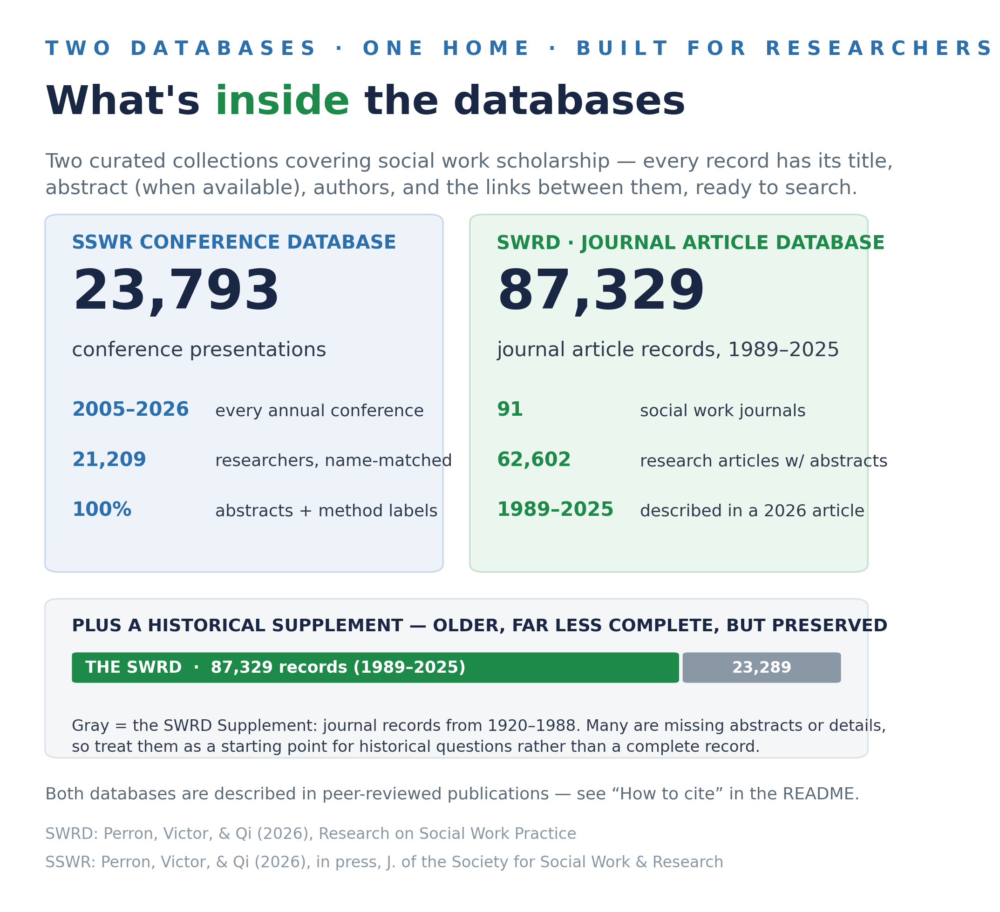
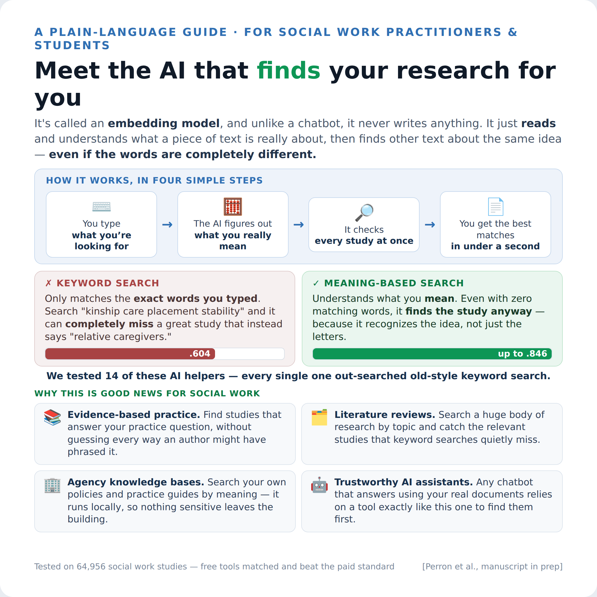
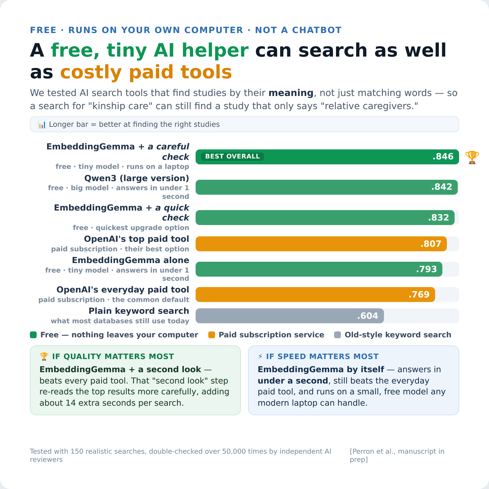

# The Social Work Research Databases

**Two carefully built collections of information *about* social work research — every conference presentation from SSWR since 2005, and decades of journal articles from the field's own journals — organized in one place so researchers can explore them.**

You don't need any technical background to understand what's here. This page explains, in plain language, what the data are, where they came from, and what you might do with them. If you have questions or would like access, just email **Brian Perron** (beperron@umich.edu).

## The two databases, in plain terms

Think of each database as a very large, very well-organized filing cabinet. Each drawer holds **records** — not the full papers themselves, but everything *about* each paper: its title, its abstract, who wrote it, when, and where it appeared.

### 1 · The SSWR Conference Database

Every presentation from the **Society for Social Work and Research annual conference, 2005 through 2026** — 23,793 in all. Each record includes:

- the **title and full abstract** of the presentation
- **every author**, in order, with their institution at the time
- the **research method** used (labeled for every single record)
- the year and format (oral presentation, poster, symposium, and so on)

One thing that makes this collection special: the **21,209 researchers have been carefully name-matched across years**. If someone presented in 2008 as "M. Smith" and in 2019 as "Mary Smith," the database knows they're the same person. That means you can trace a scholar's — or a topic's — full trajectory across two decades of conferences.

### 2 · The Social Work Research Database (SWRD)

The SWRD covers the **published journal literature**: article records from **91 disciplinary social work journals from 1989 through 2025** — 87,329 records, including **62,602 research articles with abstracts**. The database and how it was built are fully described in a 2026 article in *Research on Social Work Practice* (citation below).

Each record includes the article's title, abstract (when the journal made one available), authors and their affiliations, journal, year, and citation count. Research articles have also been **labeled by type**: whether the work is empirical, and whether the methods were quantitative, qualitative, mixed, or a review.

Two honest things to know about the SWRD:

- **Author names appear exactly as the journals published them.** Unlike the SSWR database, no name-matching has been done yet — so "J. Garcia" and "Jennifer Garcia" may be separate entries even if they're the same person. Counting *papers* is reliable; counting *unique people* is not, yet.
- **Abstracts aren't universal.** About seven in ten records from 1989 onward have them; older articles and smaller journals are less complete.

### 3 · The SWRD Supplement

Alongside the main SWRD sits a **historical supplement: 23,289 records from the same journals reaching back to 1920**. These older records are **much less complete** — many are missing abstracts or author details, simply because that information was never digitized. We keep them because they're still valuable for historical questions ("when did social work journals first publish about X?"), but they should be treated as a starting point, not a complete accounting of the era.

## What these data can be used for

A few examples of the kinds of questions these collections can help answer — no special software required, just a research question:

- **Literature mapping** — What has the field published on kinship care, and how has that changed since the 1990s?
- **Trends in the discipline** — Is empirical work growing? (It is: from 43% to 72% of publications since 1989.) Are teams getting bigger? (Also yes: from fewer than 2 authors per paper to more than 3.)
- **Scholar and program histories** — Trace a researcher's conference presentations across 20 years, or see which institutions present most in a given area.
- **Teaching** — Real, well-organized disciplinary data for research methods and doctoral courses.
- **Finding the road not taken** — Spot understudied topics, journals, or populations.

*A friendly step-by-step guide to actually using the data is coming soon.*

## The search understands what you mean

Most library databases only match the exact words you type — search "kinship care" and they can miss an excellent study that said "relative caregivers" instead. These databases include a newer kind of search that works from **meaning**, so related studies are found even when the vocabulary differs.

There's no chatbot involved and nothing is generated — this tool simply *reads* text and recognizes when two passages are about the same idea. We tested many of these tools head-to-head on tens of thousands of social work abstracts before choosing one:

Based on that testing, the databases use **EmbeddingGemma** — a small, free model from Google. It matched or beat the paid commercial options on our own literature, and it's small enough to run on an ordinary laptop, which means the search can work **privately, at no cost, with nothing sent to any company**. Every abstract in both databases has been indexed this way.

## How to cite

If you use these data in your work, please cite the article that describes the database you used:

**SWRD (journal articles):**
> Perron, B. E., Victor, B. G., & Qi, Z. (2026). Evolution of social work knowledge production over 35 years: An AI-enabled analysis of trends in empiricism, methodology, collaboration, citation patterns, and output. *Research on Social Work Practice*. https://doi.org/10.1177/10497315261416833

**SSWR (conference presentations):**
> Perron, B. E., Victor, B. G., & Qi, Z. (2026). AI-assisted curation of conference scholarship: Compiling, structuring, and analyzing two decades of presentations at the Society for Social Work and Research. *arXiv*. https://doi.org/10.48550/arXiv.2603.06814 — in press, *Journal of the Society for Social Work and Research*.

The original SWRD (version 1.0, covering 1989–2013) was introduced in: Perron, B. E., Victor, B. G., Hodge, D. R., Salas-Wright, C. P., Vaughn, M. G., & Taylor, R. J. (2017). Laying the foundations for scientometric research: A data science approach. *Research on Social Work Practice, 27*(7), 802–812. https://doi.org/10.1177/1049731515624966

## Questions, ideas, access

This is a living resource, and collaboration is welcome. If you'd like to explore the data, request a slice of it for a project, or talk through whether it fits a study you have in mind:

**Brian Perron** · University of Michigan School of Social Work · beperron@umich.edu

---

For technically minded collaborators: schema details, data-quality reports, and connection instructions live in the [`docs/`](docs/) folder, starting with the [technical overview](docs/TECHNICAL_OVERVIEW.md).
