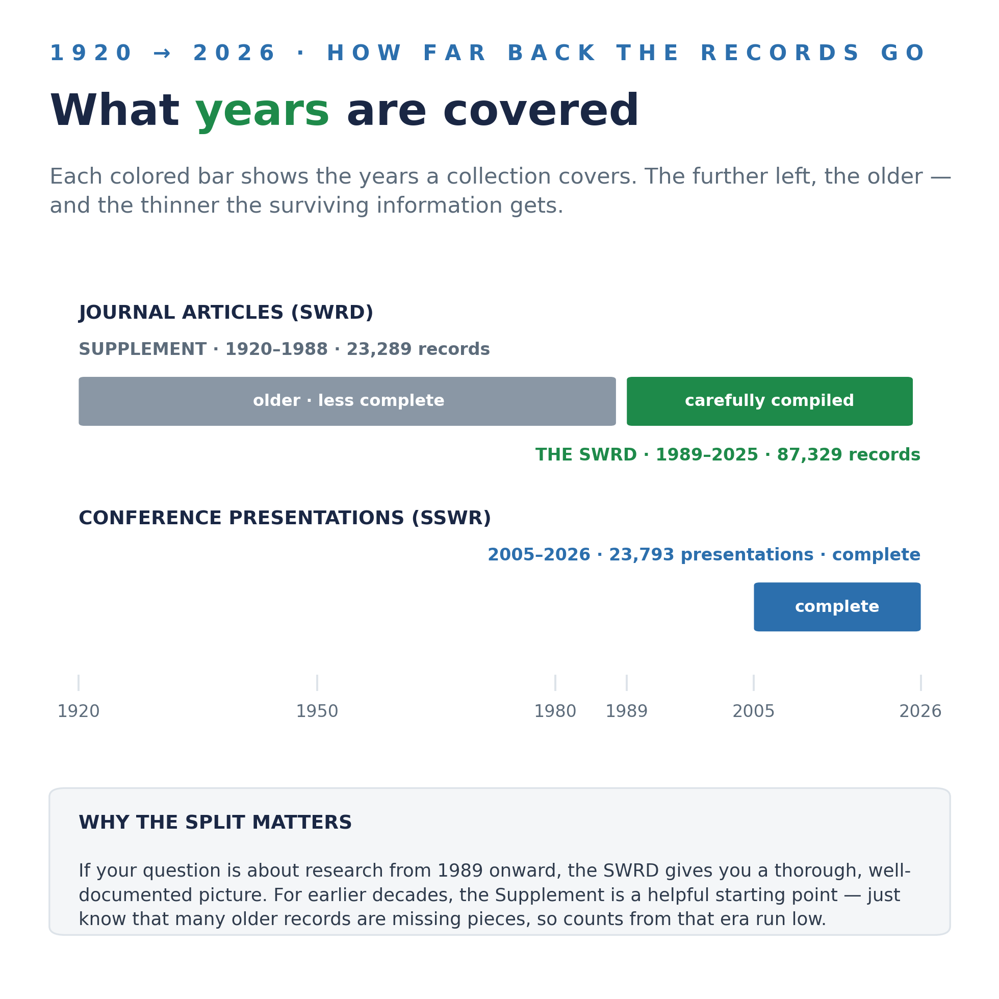
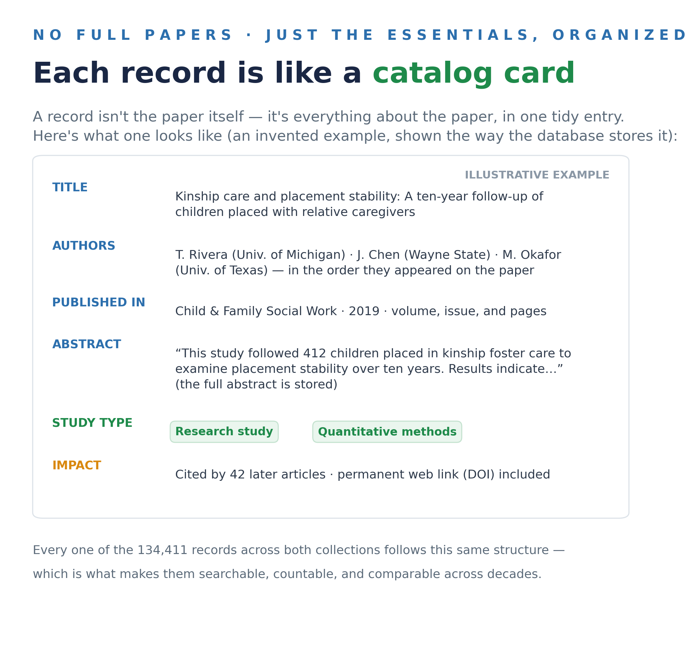

# The Social Work Research Databases

### A plain-language guide — no technical background needed

Welcome! This page describes **two large, carefully organized collections of information about social work research**: one covering **journal articles** and one covering **conference presentations**. They were built for social work researchers, educators, and students, and this guide explains everything in everyday language.

> [!NOTE]
> **Reading this on GitHub for the first time?** GitHub is simply a website where researchers share their work. This page is just a document — there is nothing to install, no account to create, and nothing here can affect your computer. Scroll and read, exactly like any webpage.

> [!TIP]
> **Two words worth knowing before you start.**
> A **database** is an organized, searchable collection of information — like a library's card catalog, but electronic.
> A **record** is one entry in that catalog: the key information *about* one study (its title, abstract, authors, and year) — not the full paper itself.

## The Social Work Research Database (SWRD)

The SWRD is a collection of records for articles published in **91 social work journals between 1989 and 2025** — the journals our discipline itself publishes, from *Social Work* to the *British Journal of Social Work* to *Research on Social Work Practice*.

At its heart are **62,602 research articles that have abstracts**, and every one of them has been labeled by study type:

- **Is it a research study?** (as opposed to an editorial, book review, or letter)
- **If so, what kind?** Quantitative (numbers and statistics), qualitative (interviews, observations, texts), mixed methods, or a review that synthesizes other studies.

These labels were applied by a carefully supervised computer program and checked against trained human readers to make sure the two agreed at a high level before any label was accepted. Around those 62,602 labeled articles sit additional records from the same journals and years — 87,329 in all — including articles for which no abstract was ever digitized.

The SWRD, and exactly how it was assembled, is fully described in a 2026 article in *Research on Social Work Practice* (the citation is at the bottom of this page). If you want to know precisely where every record came from, that article is the authoritative account.

### The SWRD Supplement — a window into the field's past

Alongside the SWRD sits a separate historical collection: **23,289 records from the same journals, reaching all the way back to 1920**.

These older records are kept apart for an honest reason: **they are much less complete**. Many are missing abstracts or author details — not because anyone was careless, but because that information was never digitized in the first place. They remain genuinely useful for historical questions (*when did our journals first publish about foster care? about AIDS? about evidence-based practice?*) — just treat any counts from those early decades as a floor, not a full accounting.

## The SSWR Conference Database

The second collection covers the **Society for Social Work and Research annual conference** — the field's largest research meeting. It holds **all 23,793 presentations from every conference between 2005 and 2026**: papers, posters, and symposia alike.

Every single record has the presentation's **full abstract** and a **research method label**. And this collection has one special strength: its **21,209 researchers have been carefully name-matched across years**. If someone presented as "M. Smith" in 2008 and "Mary Smith" in 2019, the database knows those are the same person — so you can follow a scholar's, a topic's, or a school's full trajectory across two decades of conferences.

## What one record looks like

Everything in both collections follows the same tidy structure:

## A few honest notes

Every real dataset has quirks. Here are the ones worth knowing about, in plain terms:

| | What to know |
|---|---|
| 🧑‍🤝‍🧑 | **In the SWRD, author names appear exactly as the journals printed them.** No name-matching has been done yet — so "J. Garcia" and "Jennifer Garcia" may be listed separately even if they're the same person. Counting *articles* is reliable; counting *unique people* is not, yet. (The SSWR collection *has* been name-matched.) |
| 📄 | **Not every article has an abstract.** In the SWRD, about seven in ten records from 1989 onward include one; older and smaller journals are thinner. Study-type labels exist only where an abstract exists. |
| 🕰️ | **The Supplement undercounts its era.** Records from 1920–1988 reflect what survived digitization, not everything that was published. |

## What kinds of questions can these answer?

A few examples of what researchers can do with collections like these:

| If you're wondering… | These databases can show you… |
|---|---|
| *What has the field published on kinship care?* | Every matching article and conference presentation, across decades — including ones that used different wording. |
| *Is social work research becoming more empirical?* | Yes — research studies rose from 43% of publications in the 1990s to 72% in the 2020s, one of many trends you can trace. |
| *How has a scholar's work evolved?* | Their full run of SSWR presentations, year by year, thanks to name-matching. |
| *What's understudied?* | Topics, populations, and journals where the record runs thin — the gaps are as visible as the trends. |

*A friendly, step-by-step guide to using the data yourself is coming soon. In the meantime, see the contact information below — a slice of the data for your question is easy to share.*

## The search tool inside, gently explained

Both collections include a newer kind of search that finds studies by their **meaning**, not just their exact words. Before the jargon, here's the idea:

> [!TIP]
> **What is an "embedding model"?** It's a small computer program that *reads* text and produces a kind of **meaning fingerprint** for it. Two passages about the same idea get similar fingerprints — even if they share no words. That's the entire trick. It never writes anything, never chats, and never makes anything up; it only reads and compares.

Why does this matter? Because traditional keyword search — what most library databases still use — only matches the exact words you type. Search "kinship care" and it can silently skip an excellent study that said "relative caregivers" instead. Meaning-based search catches it.

### The tool we chose, and why

Before choosing, we tested many of these tools head-to-head on tens of thousands of social work abstracts:

The winner for our purposes is **EmbeddingGemma**, a free tool released by Google. Two things make it a comfortable choice:

- **It's small.** Its size is "300M" — 300 million internal settings, which sounds huge but is *tiny* in this field (popular chatbots are thousands of times larger). Small enough that it runs on an ordinary laptop — no supercomputer, no subscription.
- **It's private and free.** Because it runs locally, nothing is sent to any company, and there is no fee — ever. In our testing it still matched or outperformed the paid commercial options on social work literature.

Every abstract in both collections — all of them — has already been read and fingerprinted this way, so meaning-based search is simply *ready*, built in.

## How to cite these databases

If these data contribute to your work, please cite the article describing the collection you used:

**For the SWRD (journal articles):**

> Perron, B. E., Victor, B. G., & Qi, Z. (2026). Evolution of social work knowledge production over 35 years: An AI-enabled analysis of trends in empiricism, methodology, collaboration, citation patterns, and output. *Research on Social Work Practice*. https://doi.org/10.1177/10497315261416833

**For the SSWR Conference Database:**

> Perron, B. E., Victor, B. G., & Qi, Z. (2026). AI-assisted curation of conference scholarship: Compiling, structuring, and analyzing two decades of presentations at the Society for Social Work and Research. *arXiv*. https://doi.org/10.48550/arXiv.2603.06814 — in press, *Journal of the Society for Social Work and Research*.

*(The SWRD's original version, covering 1989–2013, was introduced in Perron et al., 2017, Research on Social Work Practice, 27(7), 802–812.)*

## Questions, ideas, and access

This is a living resource and collaboration is genuinely welcome — whether you want to explore the data, request a slice of it for a project, or just talk through whether it fits a study you have in mind.

**Brian Perron** · University of Michigan School of Social Work · **beperron@umich.edu**

---

Technically inclined? Documentation for working with the databases directly lives in the [docs folder](docs/TECHNICAL_OVERVIEW.md).
